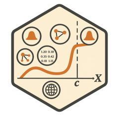

# frechesTest 

<!-- badges: start -->
[](https://github.com/dvdijcke/frechesTest/actions)
[](https://opensource.org/licenses/MIT)
<!-- badges: end -->

## Overview

The `frechesTest` package implements an ANOVA-style test for detecting discontinuities (jumps) in the conditional Fréchet mean of random objects valued in arbitrary metric spaces. This package is based on the methodology described in "A Test for Jumps in Metric-Space Conditional Means" by David Van Dijcke.

The test can detect jumps in:
- **Probability distributions** (using Wasserstein distance)
- **Covariance/correlation matrices** (using various matrix metrics)
- **Spherical data** (using geodesic distance)
- **Network Laplacians** (for graph-valued data)

## Installation

You can install the development version of frechesTest from GitHub:

```r
# install.packages("devtools")
devtools::install_github("dvdijcke/frechesTest")
```

## Quick Start

```r
library(frechesTest)

# Example: Testing for a jump in distributions
set.seed(123)
n <- 100
X <- runif(n)
Y <- vector("list", n)

# Create distributions with a jump at x = 0.5
for(i in 1:n) {
  if (X[i] < 0.5) {
    Y[[i]] <- rnorm(100, mean = 0, sd = 1)
  } else {
    Y[[i]] <- rnorm(100, mean = 2, sd = 1)  # Jump in mean
  }
}

# Test for jump at c = 0.5
result <- frechesTest(
  Y_obj = Y,
  X_scalar = X,
  c_val = 0.5,
  metric_space_type = "density",
  h_frechet = "CV",  # Use cross-validation for bandwidth
  frechet_optns = list(qSup = seq(0.01, 0.99, length.out = 100))
)

print(result$p_value)  # p-value for the test
```

## Main Features

### Supported Metric Spaces

1. **Density Space** (`metric_space_type = "density"`)
   - Uses L2-Wasserstein distance
   - Input: Raw data samples, histograms, or quantile functions
   - Requires `frechet_optns$qSup` for quantile grid

2. **Covariance/Correlation Space** (`metric_space_type = "covariance"/"correlation"`)
   - Metrics: Frobenius, power, log-Cholesky, Cholesky
   - Input: Symmetric positive definite matrices
   - Optional: `frechet_optns$metric` and `frechet_optns$alpha`

3. **Sphere Space** (`metric_space_type = "sphere"`)
   - Uses geodesic distance on unit sphere
   - Input: Unit vectors
   - Automatic normalization if needed

4. **Network Space** (`metric_space_type = "network"`)
   - For graph Laplacian matrices
   - Supports directed/undirected graphs
   - Set `frechet_optns$network_directed = TRUE` for directed graphs

### Bandwidth Selection

- **Automatic**: Set `h_frechet = "CV"` for K-fold cross-validation
- **Manual**: Provide a numeric value for fixed bandwidth
- **Undersmoothing**: Applied automatically (factor 0.9 by default)

### Advanced Options

```r
# Example with covariance matrices using log-Cholesky metric
frechet_optns <- list(
  metric = "log_cholesky",
  alpha = 1  # For power metric only
)

# Example with cross-validation options
result <- frechesTest(
  Y_obj = Y_cov,
  X_scalar = X,
  c_val = 0.5,
  metric_space_type = "covariance",
  h_frechet = "CV",
  cv_K_folds = 10,  # Number of CV folds
  cv_n_bw_candidates = 20,  # Number of bandwidth candidates
  undersmooth_factor = 0.8,  # Undersmoothing factor
  frechet_optns = frechet_optns
)
```

## Understanding the Output

The function returns a list with:

- `Tn`: Test statistic value
- `p_value`: P-value based on χ²(1) distribution
- `V_hat_plus/minus`: Estimated Fréchet variances on each side
- `l_hat_plus/minus`: Estimated Fréchet means on each side
- `f_X_hat_c`: Estimated density of X at cutoff
- `h_mean_cv_selected`: Selected bandwidth (if CV used)
- `error`: Error message if computation failed

## Citation

If you use this package in your research, please cite:

```
Van Dijcke, D. (2025). "A Test for Jumps in Metric-Space Conditional Means." 
Working Paper, University of Michigan.
```

## Getting Help

- Report bugs at [GitHub Issues](https://github.com/dvdijcke/frechesTest/issues)
- Contact: David Van Dijcke <dvdijcke@umich.edu>

## See Also

- `frechet` package: For Fréchet regression and related methods
- `fdadensity` package: For density-to-quantile conversions